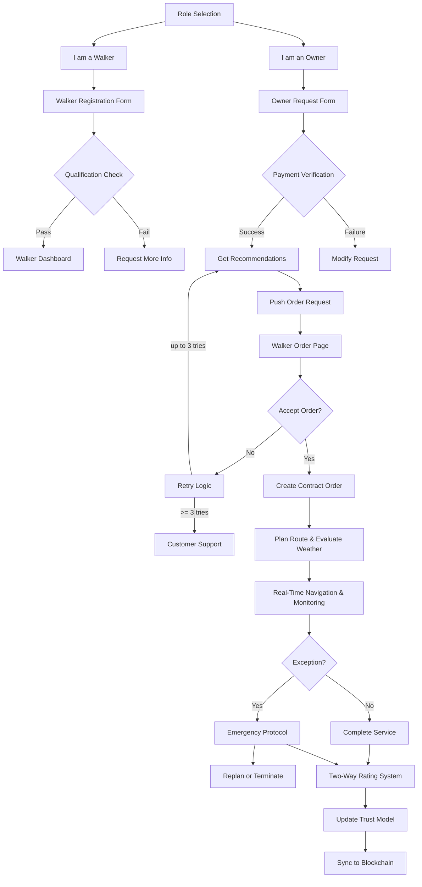

<p align="center">
  
</p>

[](https://github.com/yourusername/pawpal/stargazers) &ensp;
[](https://opensource.org/licenses/MIT) &ensp;
[](https://github.com/yourusername/pawpal/actions) &ensp;
[](https://codecov.io/gh/yourusername/pawpal) 
# PawPal

**AI-driven smart dog-walking for busy city pet owners** 
---

**Our team members** [@Nikii](https://github.com/mannaandpoem) and [@Tissa](https://github.com/Tissaaaaaa)) , along with [@Soymilk](https://github.com/Soyamilkk).

## Table of Contents  
1. [Features](#features)  
2. [Demo](#demo)  
3. [Tech Stack](#tech-stack)  
4. [Architecture](#architecture)  
5. [Quick Start](#quick-start)  
6. [API Reference](#api-reference)  
7. [Project Structure](#project-structure)  
8. [Contributing](#contributing)  
9. [License](#license)  

---

## Features  
- **Role Selection**: Instantly choose “Owner” or “Walker” on entry  ([About READMEs - GitHub Docs](https://docs.github.com/repositories/managing-your-repositorys-settings-and-features/customizing-your-repository/about-readmes?utm_source=chatgpt.com))  
- **Smart Matching**: Top-3 walker recommendations by distance, cost, rating, and availability  ([How to Write a Good README File for Your GitHub Project](https://www.freecodecamp.org/news/how-to-write-a-good-readme-file/?utm_source=chatgpt.com))  
- **Dynamic Routing**: Finds nearby dog parks and weathers routes to avoid rain or heat  ([Readme Badges GitHub: Best Practices - Daily.dev](https://daily.dev/blog/readme-badges-github-best-practices?utm_source=chatgpt.com))  
- **Real-Time Monitoring**: Live GPS tracking via WebSocket for both parties  ([Ileriayo/markdown-badges - GitHub](https://github.com/Ileriayo/markdown-badges?utm_source=chatgpt.com))  
- **Penalty & Exception Handling**: Auto-penalizes late arrivals or detours, with customer support fallback  ([How to write a good README - GitHub](https://github.com/banesullivan/README?utm_source=chatgpt.com))  
- **Two-Way Ratings**: Owners and walkers rate each other to refine future matches  ([Creating a Powerful README: Best Practices for Your Project](https://medium.com/%40berastis/creating-a-powerful-readme-best-practices-for-your-project-f974a1e69a51?utm_source=chatgpt.com))  

---

## Demo  
undermain
<p align="center">
  <video src="assets/demo.mp4" controls muted style="max-width:100%;border-radius:8px;"></video>
</p>  
_Check out the live demo on Azure Static Web Apps and see PawPal in action!_  ([Welcome! Badges 4 README.md Profile - GitHub](https://github.com/alexandresanlim/Badges4-README.md-Profile?utm_source=chatgpt.com))

---

## Tech Stack  
- **Frontend**: React, TypeScript, Azure Maps Web SDK  ([An awesome README template to jumpstart your projects! - GitHub](https://github.com/othneildrew/Best-README-Template?utm_source=chatgpt.com))  
- **Backend**: Azure Functions (Node.js), Azure AI Agents  ([About READMEs - GitHub Docs](https://docs.github.com/repositories/managing-your-repositorys-settings-and-features/customizing-your-repository/about-readmes?utm_source=chatgpt.com))  
- **Database**: Azure Cosmos DB (Mongo API)  ([About READMEs - GitHub Docs](https://docs.github.com/repositories/managing-your-repositorys-settings-and-features/customizing-your-repository/about-readmes?utm_source=chatgpt.com))  
- **CI/CD**: GitHub Actions → Azure Static Web Apps & Function App  ([README.md - badges/shields - GitHub](https://github.com/badges/shields/blob/master/README.md?utm_source=chatgpt.com))  
- **Monitoring**: Application Insights  ([How to Write a Good README File for Your GitHub Project](https://www.freecodecamp.org/news/how-to-write-a-good-readme-file/?utm_source=chatgpt.com))  

---

## Architecture  
This flow follows “Role → Form → Match → Order → Route → Complete” 



## Quick Start

### Prerequisites  
- Node.js ≥ 16  
- Azure CLI & Functions Core Tools  
- Git  

### Backend  
```bash
cd api
npm install
func start                   # Runs Azure Functions locally
```

### Frontend  
```bash
cd frontend
npm install
npm start                    # Opens http://localhost:3000
```

---

## API Reference  
| Endpoint                        | Method | Description                           |
|---------------------------------|--------|---------------------------------------|
| `/api/registerWalker`           | POST   | Register a new walker                 |
| `/api/createOwner`              | POST   | Submit owner’s walking request        |
| `/api/recommendations`          | GET    | Retrieve recommended walkers          |
| `/api/takeOrder`                | POST   | Walker accepts or declines a request  |
| `/api/order`                    | POST   | Create a new walking order            |
| `/api/planRoute`                | POST   | Plan route & fetch weather data       |
| `/api/order/{id}/complete`      | POST   | Mark order as complete                |
| `/api/order/{id}/rating`        | POST   | Submit ratings and feedback           |  ([A simple README.md template - GitHub Gist](https://gist.github.com/DomPizzie/7a5ff55ffa9081f2de27c315f5018afc?utm_source=chatgpt.com))

---

## Project Structure  
```
pawpal/
├── api/               # Azure Functions endpoints
│   ├── registerWalker/
│   ├── createOwner/
│   ├── recommendations/
│   └── ...
├── frontend/          # React application
│   ├── public/
│   ├── src/
│   │   ├── components/
│   │   ├── pages/
│   │   └── services/
│   └── .env
├── .github/           # CI/CD workflows
│   └── workflows/
└── README.md
```  

---

## Contributing  
1. Fork this repo  
2. Create a feature branch (`git checkout -b feature/your-feature`)  
3. Commit your changes (`git commit -m "feat: add new feature"`)  
4. Push to your branch (`git push origin feature/your-feature`)  
5. Open a Pull Request  ([jehna/readme-best-practices - GitHub](https://github.com/jehna/readme-best-practices?utm_source=chatgpt.com))

---

## License  
This project is licensed under the **MIT License**. See [LICENSE](LICENSE) for details.

---
Feel free to open issues or submit PRs—your feedback is welcome! 
